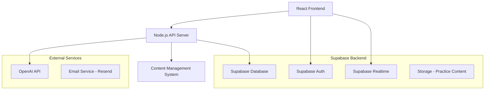

# Design Document

## Overview

The ISEE AI Tutor is a modern web application built with a React frontend and Node.js backend, utilizing Supabase for authentication, database, and real-time features. The application employs AI services (OpenAI GPT-4) for personalized tutoring, content generation, and essay analysis. The architecture supports scalable, real-time learning experiences with comprehensive progress tracking and adaptive learning algorithms.

## Architecture

### High-Level Architecture



### Technology Stack

**Frontend:**
- React 18 with TypeScript
- Tailwind CSS for styling
- React Router for navigation
- React Query for state management and caching
- Chart.js for progress visualization
- Supabase client for real-time features

**Backend:**
- Node.js with Express.js
- TypeScript for type safety
- Supabase for database, auth, and storage
- OpenAI API for AI tutoring capabilities
- Resend for email notifications

**Database:**
- PostgreSQL (via Supabase)
- Real-time subscriptions for live updates
- Row Level Security (RLS) for data protection

## Components and Interfaces

### Core Components

#### 1. Authentication System
- **Registration/Login Component**: Handles user signup and signin
- **Profile Setup**: Collects exam date and initial assessment
- **Parent Access**: Optional parent/guardian account linking

#### 2. Dashboard Component
- **Study Timeline**: Visual representation of time until exam
- **Progress Overview**: Charts showing performance across subjects
- **Daily Goals**: Personalized daily practice recommendations
- **Achievement System**: Badges and milestones

#### 3. Practice Modules

**Math Practice Component:**
- Problem generator with ISEE-aligned content
- Interactive problem solver with step-by-step hints
- Adaptive difficulty based on performance
- Topic-specific practice (arithmetic, algebra, geometry, data analysis)

**English Practice Component:**
- Reading comprehension passages with questions
- Vocabulary builder with spaced repetition
- Synonym/antonym exercises
- Sentence completion practice

**Essay Practice Component:**
- Prompt generator with age-appropriate topics
- Rich text editor with writing tools
- AI-powered essay analysis and feedback
- Revision tracking and comparison

#### 4. AI Tutor System
- **Contextual Help**: On-demand explanations and hints
- **Performance Analysis**: Pattern recognition and personalized recommendations
- **Adaptive Learning**: Dynamic content difficulty adjustment
- **Natural Language Interface**: Chat-based tutoring support

### API Interfaces

#### Authentication Endpoints
```typescript
POST /auth/register
POST /auth/login
POST /auth/logout
GET /auth/profile
PUT /auth/profile
```

#### Practice Endpoints
```typescript
GET /practice/math/problems
POST /practice/math/submit
GET /practice/english/passages
POST /practice/english/submit
GET /practice/essay/prompts
POST /practice/essay/submit
POST /practice/essay/analyze
```

#### Progress Endpoints
```typescript
GET /progress/dashboard
GET /progress/detailed/:subject
POST /progress/goals
GET /analytics/performance
```

#### AI Tutor Endpoints
```typescript
POST /tutor/explain
POST /tutor/hint
POST /tutor/chat
GET /tutor/recommendations
```

## Data Models

### User Model
```typescript
interface User {
  id: string;
  email: string;
  firstName: string;
  lastName: string;
  examDate: Date;
  gradeLevel: number;
  createdAt: Date;
  updatedAt: Date;
  parentEmail?: string;
  preferences: UserPreferences;
}

interface UserPreferences {
  studyReminders: boolean;
  parentNotifications: boolean;
  difficultyLevel: 'adaptive' | 'beginner' | 'intermediate' | 'advanced';
  dailyGoalMinutes: number;
}
```

### Practice Session Model
```typescript
interface PracticeSession {
  id: string;
  userId: string;
  subject: 'math' | 'english' | 'essay';
  startTime: Date;
  endTime: Date;
  questionsAttempted: number;
  questionsCorrect: number;
  topics: string[];
  difficultyLevel: number;
  aiInteractions: AIInteraction[];
}

interface AIInteraction {
  type: 'hint' | 'explanation' | 'feedback';
  content: string;
  timestamp: Date;
}
```

### Content Model
```typescript
interface MathProblem {
  id: string;
  topic: string;
  difficulty: number;
  question: string;
  options?: string[];
  correctAnswer: string;
  explanation: string;
  hints: string[];
}

interface ReadingPassage {
  id: string;
  title: string;
  content: string;
  gradeLevel: number;
  questions: ReadingQuestion[];
  vocabulary: VocabularyWord[];
}

interface EssayPrompt {
  id: string;
  prompt: string;
  type: 'narrative' | 'expository' | 'persuasive';
  gradeLevel: number;
  timeLimit: number;
  rubric: EssayRubric;
}
```

### Progress Model
```typescript
interface UserProgress {
  userId: string;
  subject: string;
  overallScore: number;
  topicScores: Record<string, number>;
  streakDays: number;
  totalPracticeTime: number;
  lastPracticeDate: Date;
  weakAreas: string[];
  strongAreas: string[];
}
```

## Error Handling

### Frontend Error Handling
- **Network Errors**: Retry mechanism with exponential backoff
- **Authentication Errors**: Automatic redirect to login with session restoration
- **Validation Errors**: Real-time form validation with clear error messages
- **AI Service Errors**: Graceful degradation with cached responses

### Backend Error Handling
- **Database Errors**: Connection pooling and automatic retry
- **External API Errors**: Circuit breaker pattern for OpenAI API
- **Rate Limiting**: Implement rate limiting for AI requests
- **Data Validation**: Comprehensive input validation and sanitization

### Error Logging and Monitoring
- Structured logging with correlation IDs
- Error tracking with Sentry or similar service
- Performance monitoring for AI response times
- User experience metrics tracking

## Testing Strategy

### Unit Testing
- **Frontend**: Jest and React Testing Library for component testing
- **Backend**: Jest for API endpoint and business logic testing
- **Database**: Supabase local development with test data
- **AI Integration**: Mock OpenAI responses for consistent testing

### Integration Testing
- **API Integration**: Supertest for full API workflow testing
- **Database Integration**: Test database operations with real Supabase instance
- **Authentication Flow**: End-to-end auth testing with Supabase Auth
- **AI Workflow**: Integration tests with OpenAI API using test keys

### End-to-End Testing
- **User Journeys**: Playwright for complete user workflow testing
- **Cross-browser Testing**: Automated testing across major browsers
- **Mobile Responsiveness**: Testing on various device sizes
- **Performance Testing**: Load testing for concurrent users

### Content Quality Assurance
- **Educational Content**: Review by education professionals
- **AI Response Quality**: Regular evaluation of AI tutor responses
- **Accessibility Testing**: WCAG 2.1 compliance testing
- **Age Appropriateness**: Content review for middle school audience

## Security Considerations

### Data Protection
- **Encryption**: All data encrypted at rest and in transit
- **Privacy Compliance**: COPPA compliance for users under 13
- **Data Minimization**: Collect only necessary user information
- **Right to Deletion**: Implement complete data removal capabilities

### Authentication Security
- **Supabase Auth**: Leverages industry-standard authentication
- **Session Management**: Secure session handling with automatic expiration
- **Password Requirements**: Strong password policies
- **Multi-factor Authentication**: Optional 2FA for enhanced security

### API Security
- **Rate Limiting**: Prevent abuse of AI and practice endpoints
- **Input Validation**: Comprehensive sanitization of user inputs
- **CORS Configuration**: Proper cross-origin resource sharing setup
- **API Key Management**: Secure storage and rotation of external API keys

## Performance Optimization

### Frontend Performance
- **Code Splitting**: Lazy loading of practice modules
- **Caching Strategy**: React Query for intelligent data caching
- **Image Optimization**: Optimized images for math diagrams and content
- **Bundle Optimization**: Tree shaking and minification

### Backend Performance
- **Database Optimization**: Proper indexing and query optimization
- **Caching Layer**: Redis for frequently accessed content
- **AI Response Caching**: Cache common AI responses to reduce API calls
- **Connection Pooling**: Efficient database connection management

### Scalability Considerations
- **Horizontal Scaling**: Stateless API design for easy scaling
- **CDN Integration**: Content delivery network for static assets
- **Database Scaling**: Supabase automatic scaling capabilities
- **Monitoring**: Performance monitoring and alerting systems